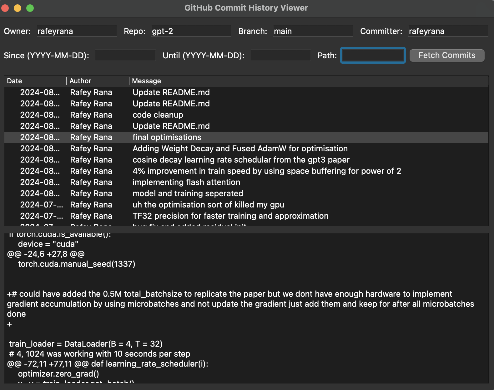

# GitHub Commit History Viewer

This application allows you to visualize and explore the commit history of any GitHub repository with customizable parameters. It provides a user-friendly interface to analyze code changes across different commits and files.

## Features

- **Flexible Repository Selection**: Enter any GitHub repository owner and name to fetch its commit history.
- **Branch Filtering**: Specify a particular branch to focus on specific development lines.
- **Committer Filtering**: View commits from a specific contributor by entering their username.
- **Date Range Selection**: Set 'Since' and 'Until' dates to analyze commits within a specific time frame.
- **Path-based Filtering**: Focus on changes in specific files or directories by entering a file path.
- **Detailed Commit Information**: View commit date, author, and commit message for each entry.
- **Code Diff Visualization**: Select a commit to see detailed changes, including file modifications, additions, and deletions.

## How It Works

1. **Input Parameters**: Enter the desired repository details and filtering criteria in the top section of the interface.
2. **Fetch Commits**: Click the "Fetch Commits" button to retrieve the commit history based on your parameters.
3. **Browse Commits**: The main window displays a list of commits matching your criteria, showing date, author, and commit message.
4. **View Changes**: Click on any commit in the list to see detailed code changes in the bottom pane, including file-by-file diffs.

## How to Run

To run this project on your local machine, follow these steps:

1. Clone the repository: `git clone https://github.com/rafeyrana/DAILY-PM.git`
2. Navigate to the project directory: `cd DAILY-PM`
3. Install the required dependencies: `pip install -r requirements.txt`
4. Run the application: python commit_history.py

## Benefits

- **Efficient Code Review**: Quickly navigate through commit history and understand code evolution.
- **Customizable Analysis**: Tailor your view to focus on specific aspects of the repository's development.
- **Comprehensive Change Tracking**: Visualize both high-level commit information and detailed code modifications in one interface.

This tool streamlines the process of exploring GitHub repositories, making it easier for developers, code reviewers, and project managers to track and understand code changes over time.